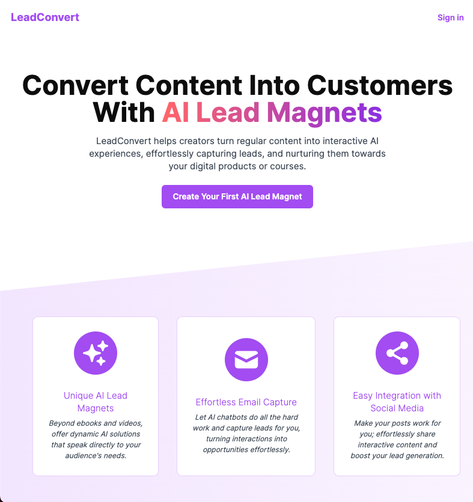
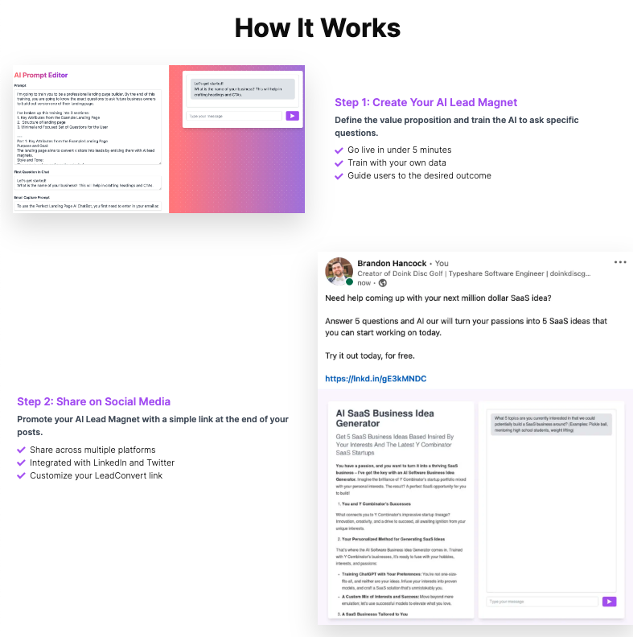
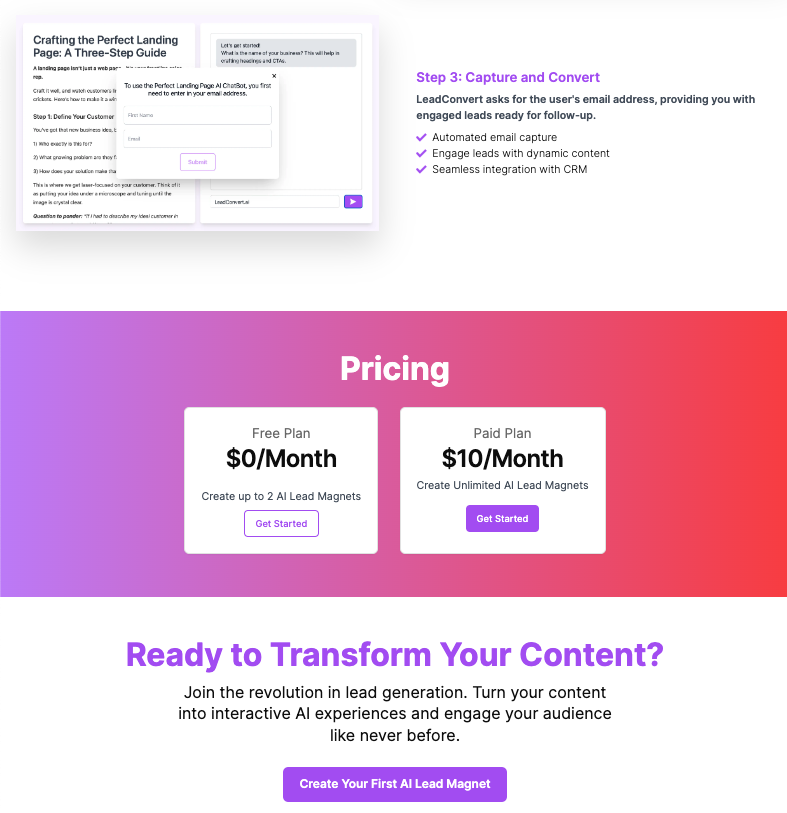

# Capture your Lead using AI technology

This app is designed for clients to create a problem-solving page (where AI works behind the scenes) and then publish it to a publicly accessible platform. When someone visits the page, they can send a question via a chatbox. Before receiving a response, the individual is prompted to enter their email address to proceed. The email address is collected as a new lead for the client.

## Technology used

1. React, TypeScript, NextJS, Tailwind CSS
2. Clerk Authentication, Prisma/PlanetScale, Uploadthing, Tiptap, Open AI, Stripe

## Demo View (Landing page)

